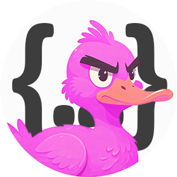

<a name="readme-top"></a>
[](README-en.md) [](README.md) 
 [](https://github.com/anond0rf/vecchioserver/releases) [](https://goreportcard.com/report/github.com/anond0rf/vecchioserver) [](https://github.com/anond0rf/vecchioserver)
<br />
<div align="center">
  <a href="https://github.com/anond0rf/vecchioserver">
    
  </a>
<h3 align="center">VecchioServer</h3>
  <p align="center">
    <strong>VecchioServer</strong> is a RESTful server for posting on <a href="https://vecchiochan.com/">vecchiochan.com</a>
    <br />
    <br />
    <a href="#download"><strong>Get Started »</strong></a>
    <br />
    <br />
    <a href="https://github.com/anond0rf/vecchioserver/releases">Releases</a>
    ·
    <a href="https://github.com/anond0rf/vecchioserver/issues">Report Bug</a>
    ·
    <a href="https://github.com/anond0rf/vecchioserver/issues">Request Feature</a>
  </p>
</div>

## Features

VecchioServer exposes an API that follows the OpenAPI specification and includes a Swagger UI for easy testing and documentation.  
The server abstracts away the details of form submission and request handling through the use of [vecchioclient](https://github.com/anond0rf/vecchioclient).  
Through the exposed `/thread` and `/reply` endpoints you can:  

- Create new threads on specific boards
- Reply to existing threads

Custom server port, as well as custom `User Agent` header to be used by the internal client and verbose logging are all supported (see [Running the Server](#running-the-server)).  
No read functionality is provided as NPFchan already exposes the vichan  [API](https://github.com/vichan-devel/vichan-API/).  

## Table of Contents

1. [Download](#download)
2. [Running the Server](#running-the-server)
3. [Swagger API Documentation](#swagger-api-documentation)
4. [Usage](#usage)
    - [Creating a Thread](#creating-a-thread)
    - [Posting a Reply](#posting-a-reply)
5. [Building the Project](#building-the-project)
6. [License](#license)

## Download

VecchioServer is available for Windows, GNU/Linux and MacOS.  
Binaries for the latest release can be downloaded [here](https://github.com/anond0rf/vecchioserver/releases).

## Running the Server

For simplicity, we assume `vecchioserver` to be the name of the executable.
To run the server:

```powershell
# windows
vecchioserver
```
```sh
# linux / macos
./vecchioserver
```

The following flags are available:

- `-p` or `--port`: Custom port to run the server on (default: `8080`).  
- `-u` or `--user-agent`: Custom User-Agent header to be used by the internal client.  
- `-v` or `--verbose`: Enables verbose logging for detailed logs.  

Example:

```powershell
# windows
vecchioserver -p 9000 -u "MyCustomAgent" -v
```

The server will now run on port `9000`, use "MyCustomAgent" as the `User-Agent` HTTP header in the internal client, and enable verbose logging.  

## Swagger API Documentation

Once the server is running, you can access the Swagger documentation at:

```
http://localhost:8080/swagger/index.html
```

This provides a user-friendly UI for exploring the API and testing out requests.

## Usage

Here are some examples of how to use the API.  
Port is assumed to be default (`8080`).  
Refer to the swagger `Schemas` section of the documentation to view all the available fields and their description.  
Non-mandatory fields can be omitted as done in the below examples.

- #### Creating a Thread

  Creating a thread can be done by sending a `POST` request to the `/thread` endpoint:

  ```bash
  curl -X 'POST' \
    'http://localhost:8080/thread' \
    -H 'accept: application/json' \
    -H 'Content-Type: application/json' \
    -d '{
    "board": "b",
    "body": "This is a new thread on board /b/",
    "files": [
      "C:\\path\\to\\file.jpg"
    ]
  }'
  ```

  **board** is the only **mandatory** field but keep in mind that, as the settings vary across boards, more fields are probably required for posting (e.g. you can't post a new thread with no embed nor files on /b/).  

- #### Posting a Reply

  Posting a reply can be done by sending a `POST` request to the `/reply` endpoint:

  ```bash
  curl -X 'POST' \
    'http://localhost:8080/reply' \
    -H 'accept: application/json' \
    -H 'Content-Type: application/json' \
    -d '{
    "board": "b",
    "body": "This is a new reply to thread #1 of board /b/",
    "files": [
      "C:\\path\\to\\file1.mp4",
      "C:\\path\\to\\file2.webm"
    ],
    "thread": 1
  }'
  ```

  **board** and **thread** are the only **mandatory** fields but keep in mind that, as the settings vary across boards, more fields are probably required for replying.

## Building the Project

To build the project:

1. Make sure you have [Go](https://golang.org/dl/) installed.
2. Clone the repository with [git](https://github.com/git/git):

   ```sh
   git clone https://github.com/anond0rf/vecchioserver.git
   ```
3. Change directory to the project folder:

   ```sh
   cd vecchioserver
   ```

4. **Optional**: if you intend to modify the `api/openapi.yaml` file, you need to install  [oapi-codegen](https://github.com/oapi-codegen/oapi-codegen) and run the following command to regenerate the OpenAPI types, server and specification:

   ```sh
   oapi-codegen -generate types,server,spec -o internal/handlers/server.gen.go -package handlers api/openapi.yaml
   ```

5. Build the project:

   ```sh
   go build ./cmd/vecchioserver
   ```

An executable file will be produced in the root of the project.

## License

VecchioServer is licensed under the [LGPL-3.0 License](https://www.gnu.org/licenses/lgpl-3.0.html).  

This means you can use, modify, and distribute the software, provided that any modified versions are also licensed under the LGPL-3.0.  

For more details, please see the full text of the license in the [LICENSE](./LICENSE) file.  

Copyright © 2024 anond0rf
