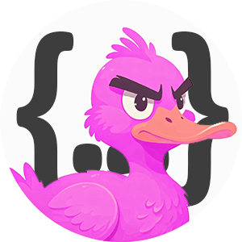

<a name="readme-top"></a>
[](README-en.md) [](README.md) 
 [](https://github.com/anond0rf/vecchioserver/releases) [](https://github.com/anond0rf/vecchioserver)
<br />
<div align="center">
  <a href="https://github.com/anond0rf/vecchioserver">
    
  </a>
<h3 align="center">VecchioServer</h3>
  <p align="center">
    <strong>VecchioServer</strong> è un server RESTful progettato per postare su <a href="https://vecchiochan.com/">vecchiochan.com</a>
    <br />
    <br />
    <a href="#download"><strong>Inizia »</strong></a>
    <br />
    <br />
    <a href="https://github.com/anond0rf/vecchioserver/releases">Release</a>
    ·
    <a href="https://github.com/anond0rf/vecchioserver/issues">Segnala Bug</a>
    ·
    <a href="https://github.com/anond0rf/vecchioserver/issues">Richiedi Feature</a>
  </p>
</div>

## Caratteristiche

VecchioServer è un wrapper di [vecchioclient](https://github.com/anond0rf/vecchioclient). Espone un'API che segue la specifica OpenAPI e include una UI Swagger per testare l'API e consultare la documentazione.  
Attraverso gli endpoint esposti `/thread` e `/reply` puoi:

- Creare nuovi thread su board specifiche
- Rispondere a thread già esistenti

E' possibile cambiare la porta su cui il server rimane in ascolto, personalizzare l'header User-Agent utilizzato dal client interno e abilitare il logging dettagliato (vedi [Avvio del server](#avvio-del-server)).  
Nessuna funzionalità di lettura viene fornita poiché NPFchan espone già l'[API](https://github.com/vichan-devel/vichan-API/) di vichan.

## Indice


1. [Download](#download)
2. [Avvio del server](#avvio-del-server)
3. [Documentazione API Swagger](#documentazione-api-swagger)
4. [Utilizzo](#utilizzo)
    - [Pubblicare un nuovo thread](#pubblicare-un-nuovo-thread)
    - [Postare una risposta](#postare-una-risposta)
5. [Compilare il progetto](#compilare-il-progetto)
6. [Licenza](#licenza)

## Download

VecchioServer è disponibile per Windows, GNU/Linux e MacOS.  
L'eseguibile dell'ultima versione si può scaricare da [qui](https://github.com/anond0rf/vecchioserver/releases).

## Avvio del server

Per avviare il server:

```powershell
# windows
vecchioserver
```
```sh
# linux / macos
./vecchioserver
```

Sono disponibili le seguenti opzioni:

- `-p` o `--port`: Porta personalizzata per eseguire il server (default: `8080`).  
- `-u` o `--user-agent`: Header User-Agent personalizzato utilizzato dal client interno.  
- `-v` o `--verbose`: Abilita il logging dettagliato per log più specifici.  

Esempio:

```powershell
# windows
vecchioserver -p 9000 -u "MyCustomAgent" -v
```

Il server verrà eseguito sulla porta `9000`, utilizzerà "MyCustomAgent" come header `User-Agent` nelle richieste del client interno e abiliterà il logging dettagliato.

## Documentazione API Swagger

Una volta che il server è in esecuzione, puoi accedere alla documentazione Swagger all'indirizzo:

```
http://localhost:8080/swagger/index.html
```

Questa pagina fornisce un'interfaccia intuitiva per esplorare l'API e testare le richieste.

## Utilizzo

Di seguito alcuni esempi su come utilizzare l'API.  
Si assume che la porta sia quella di default (`8080`).  
Fai riferimento alla sezione `Schemas` della documentazione Swagger per vedere tutti i campi disponibili e la loro descrizione.  
Come negli esempi qui sotto, i campi non obbligatori possono essere omessi.

- #### Pubblicare un nuovo thread

  Creare un thread può essere fatto inviando una richiesta `POST` all'endpoint `/thread`:

  ```bash
  curl -X 'POST' \
    'http://localhost:8080/thread' \
    -H 'accept: application/json' \
    -H 'Content-Type: application/json' \
    -d '{
    "board": "b",
    "body": "Questo è un nuovo thread sulla board /b/",
    "files": [
      "C:\\path\\to\\file.jpg"
    ]
  }'
  ```

  **board** è l'unico campo **obbligatorio**, ma tieni presente che, poiché ogni board ha le sue impostazioni, potrebbero essere necessari più campi per postare (ad esempio, non è possibile postare un nuovo thread senza embed né file su /b/).

- #### Pubblicare una risposta

  Per pubblicare una risposta, invia una richiesta `POST` all'endpoint `/reply`:

  ```bash
  curl -X 'POST' \
    'http://localhost:8080/reply' \
    -H 'accept: application/json' \
    -H 'Content-Type: application/json' \
    -d '{
    "board": "b",
    "body": "Questa è una nuova risposta al thread #1 della board /b/",
    "files": [
      "C:\\path\\to\\file1.mp4",
      "C:\\path\\to\\file2.webm"
    ],
    "thread": 1
  }'
  ```

  **board** e **thread** sono gli unici campi **obbligatori**, ma tieni presente che, poiché ogni board ha le sue impostazioni, potrebbero essere necessari più campi per postare.

## Compilare il progetto

Per compilare il progetto:

1. Assicurati di avere installato [Go](https://golang.org/dl/).
2. **Opzionale**: se intendi modificare il file `api/openapi.yaml`, devi installare [oapi-codegen](https://github.com/oapi-codegen/oapi-codegen) ed eseguire il seguente comando per rigenerare i tipi OpenAPI, il server e la specifica:

   ```sh
   oapi-codegen -generate types,server,spec -o internal/handlers/server.gen.go -package handlers api/openapi.yaml
   ```

3. Compila il progetto:

   ```sh
   go build ./cmd/vecchioserver
   ```

Verrà generato un file eseguibile nella directory principale del progetto.

## Licenza

VecchioServer is licensed under the [LGPL-3.0 License](./LICENSE). 

This means you can use, modify, and distribute the software, provided that any modified versions are also licensed under the LGPL-3.0. 

For more details, please see the full text of the license in the [LICENSE](./LICENSE) file.

Copyright © anond0rf

